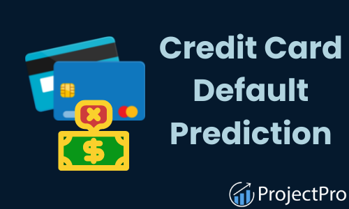

 
  

<h1 align="center"> Credit Card Defaulter prediction </h1>

 

<h2> :book: Problem Statement</h2>
The Credit Card Fraud Detection Problem includes modeling past credit card transactions with the knowledge of the ones that turned out to be a fraud. This model is then used to identify whether a new transaction is fraudulent or not.

<h2> :book:Introduction</h2>
This dataset contains information on default payments, demographic factors, credit data, history of payment, and bill statements of credit card clients in Taiwan from April 2005 to September 2005.

<h2> :floppy_disk: Project Files Description</h2>
We will build a random forest model to predict whether a given customer defaults or not. Credit default is one of the most important problems in the banking and risk analytics industry. There are various attributes which can be used to predict default, such as demographic data (age, income, employment status, etc.), (credit) behavioural data (past loans, payment, number of times a credit payment has been delayed by the customer etc.).

<h2> :book: Data Summery</h2>
# There are 25 variables:

* - **ID**: ID of each client

* - **LIMIT_BAL**: Amount of given credit in NT dollars (includes individual and family/supplementary credit

* - **SEX**: Gender (1=male, 2=female)

*- **EDUCATION**: (1=graduate school, 2=university, 3=high school, 4=others, 5=unknown, 6=unknown)

* - **MARRIAGE**: Marital status (1=married, 2=single, 3=others)
* - **AGE**: Age in years
* - **PAY_0**: Repayment status in September, 2005 (-1=pay duly, 1=payment delay for one month, 2=payment delay for two months, … 8=payment delay for eight months, 9=payment delay for nine months and above)
* - **PAY_2**: Repayment status in August, 2005 (scale same as above)
* - **PAY_3**: Repayment status in July, 2005 (scale same as above)
* - **PAY_4**: Repayment status in June, 2005 (scale same as above)
* - **PAY_5**: Repayment status in May, 2005 (scale same as above)
* - **PAY_6**: Repayment status in April, 2005 (scale same as above)
* - **BILL_AMT1**: Amount of bill statement in September, 2005 (NT dollar)
* - **BILL_AMT2**: Amount of bill statement in August, 2005 (NT dollar)
* - **BILL_AMT3**: Amount of bill statement in July, 2005 (NT dollar)
* - **BILL_AMT4**: Amount of bill statement in June, 2005 (NT dollar)
* - **BILL_AMT5**: Amount of bill statement in May, 2005 (NT dollar)
* - **BILL_AMT6**: Amount of bill statement in April, 2005 (NT dollar)
* - **PAY_AMT1**: Amount of previous payment in September, 2005 (NT dollar)
* - **PAY_AMT2**: Amount of previous payment in August, 2005 (NT dollar)
* - **PAY_AMT3**: Amount of previous payment in July, 2005 (NT dollar)
* - **PAY_AMT4**: Amount of previous payment in June, 2005 (NT dollar)
* - **PAY_AMT5**: Amount of previous payment in May, 2005 (NT dollar)
* - **PAY_AMT6**: Amount of previous payment in April, 2005 (NT dollar)
* - **default.payment.next.month**: Default payment (1=yes, 0=no)
  
<h2> :book: Depoyment on Heroku</h2>

https://credit-card-defulter-predict.herokuapp.com/

